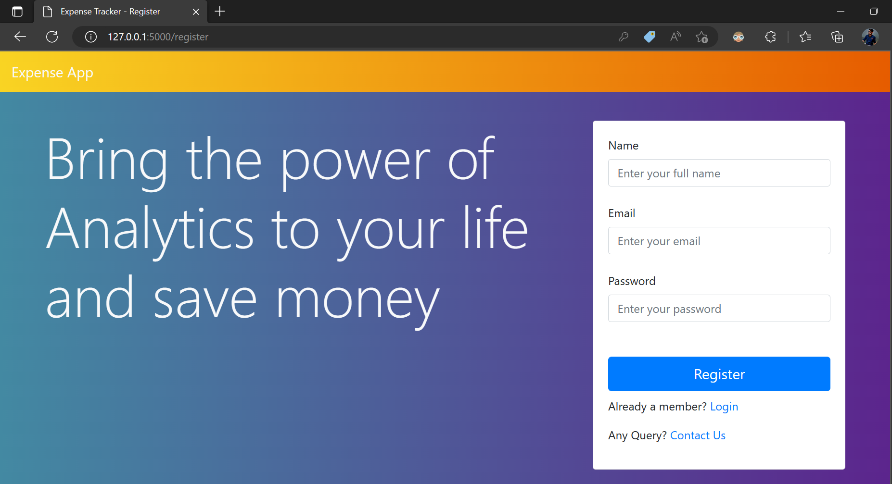

# Flask Expense Tracker

A Flask-based Expense Tracker web application to **record, categorize, and analyze daily expenses** with a simple and intuitive dashboard.

---

## 🔹 Features

- Add, edit, and delete expenses  
- Categorize expenses (e.g., Food, Travel, Bills, Entertainment)  
- View daily, weekly, and monthly expense reports  
- Dashboard with total income, total expenses, and balance  
- Responsive UI using Bootstrap  
- Persistent storage using SQLite  

---

## 🔹 Screenshots

> Below are sample screenshots of the application:

### 1. Dashboard


### 2. Add Expense
.png)

### 3. Expense Report
.png)

### 4.profile
.png)


### contact
.png)

> ⚠️ Note: Replace the above screenshot paths with your actual images inside a `screenshots` folder in your repo.

---

## 🔹 Tech Stack

- **Backend:** Python, Flask  
- **Frontend:** HTML, CSS, Bootstrap  
- **Database:** SQLite  
- **Others:** Jinja2 templates, Flask-WTF for forms  

---

## 🔹 Installation & Setup

1. **Clone the repository**
```bash
git clone https://github.com/username/flask-expense-tracker.git
cd flask-expense-tracker

Create virtual environment

python -m venv venv


Activate virtual environment

Windows:

venv\Scripts\activate


Mac/Linux:

source venv/bin/activate


Install dependencies

pip install -r requirements.txt


Run the Flask app

python app.py


Open in browser

http://127.0.0.1:5000

🔹 Folder Structure (Example)
flask-expense-tracker/
│
├─ app.py
├─ templates/
│   ├─ base.html
│   ├─ dashboard.html
│   └─ add_expense.html
├─ static/
│   ├─ css/
│   └─ images/
├─ screenshots/          # Store screenshots here
├─ requirements.txt
└─ README.md
